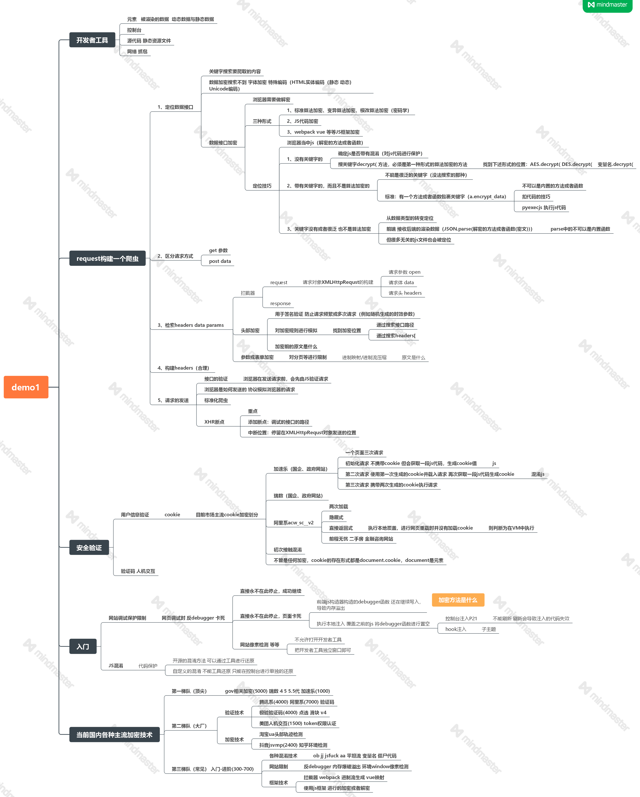
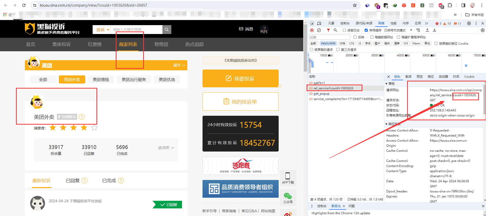
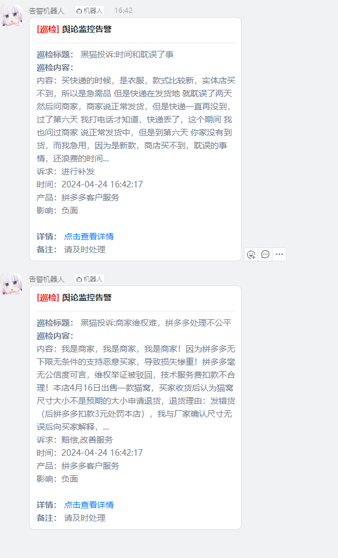
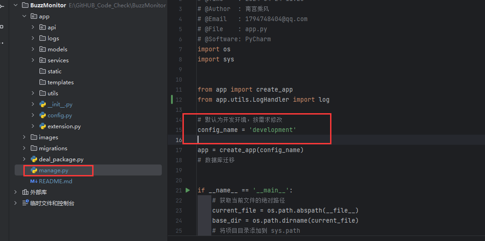
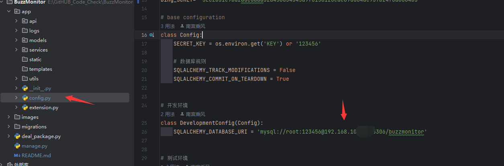
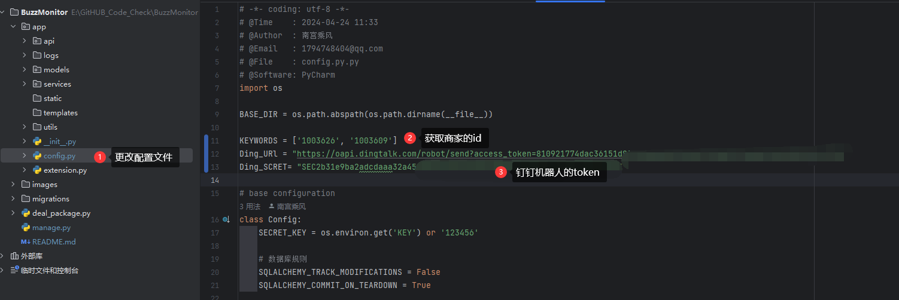
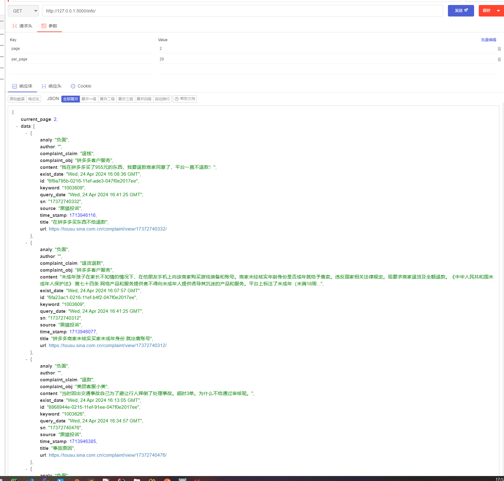

# BuzzMonitor
# **黑猫投诉平台，舆论监控系统**

## 简介

 "[黑猫投诉](https://tousu.sina.com.cn/)"舆论监控系统是一款专为快速识别和响应网络投诉而设计的应用，旨在帮助企业或机构第一时间掌握公众意见和反馈。通过实时监控网站及其他在线平台，系统能够迅速侦测到关于品牌或服务的负面评论、投诉或提议。

 

## 流程

  **下面是一张主流网页加密方法的思维导图** ， **黑猫投诉平台网站使用的即是请求头加密。** 



 参考文档：[https://blog.csdn.net/qq_45270849/article/details/135416529](https://blog.csdn.net/qq_45270849/article/details/135416529)


## 针对企业公司关键字

比如：美团外卖

1、打开页面 https://tousu.sina.com.cn/company/view/?couid=1003626&sid=26857

2、找到商家列表，获取到couid的值，这就是关键字

3、根据关键字组合，解密获取到api接口的数据




## 定时任务

爬虫是定时任务驱动，使用`apscheduler`

```python
    # 创建一个后台调度器
    scheduler = BackgroundScheduler(timezone="Asia/Shanghai")
    # 添加一个每隔20秒执行一次的定时任务 测试
    scheduler.add_job(func=send_alert, trigger="interval", seconds=20)
    # 添加一个每隔10分钟 执行的定时任务
    scheduler.add_job(func=get_heimao, trigger=CronTrigger(minute='*/10'))
    # 启动调度器
    scheduler.start()
    return app
```


## 发送钉钉告警





## 使用方式

1、数据库创建数据库名称和执行命令





```
pip3 install Flask-Migrate

初始化(只需要执行一次)
flask db init
生成文件
flask db migrate
迁移数据库
flask db upgrade

记得 （我已经导入）
只需要在 app.py 中导入 models.py 中的类即可。
而且导入全部和导入一个，结果都是可以对所有的表进行创建。
```


2、设置爬虫的信息



##  接口分页获取数据库内容

```
http://127.0.0.1:5000/info/


        # 默认值
        page = int(request.args.get('page', 1))
        per_page = int(request.args.get('per_page', 10))
```

