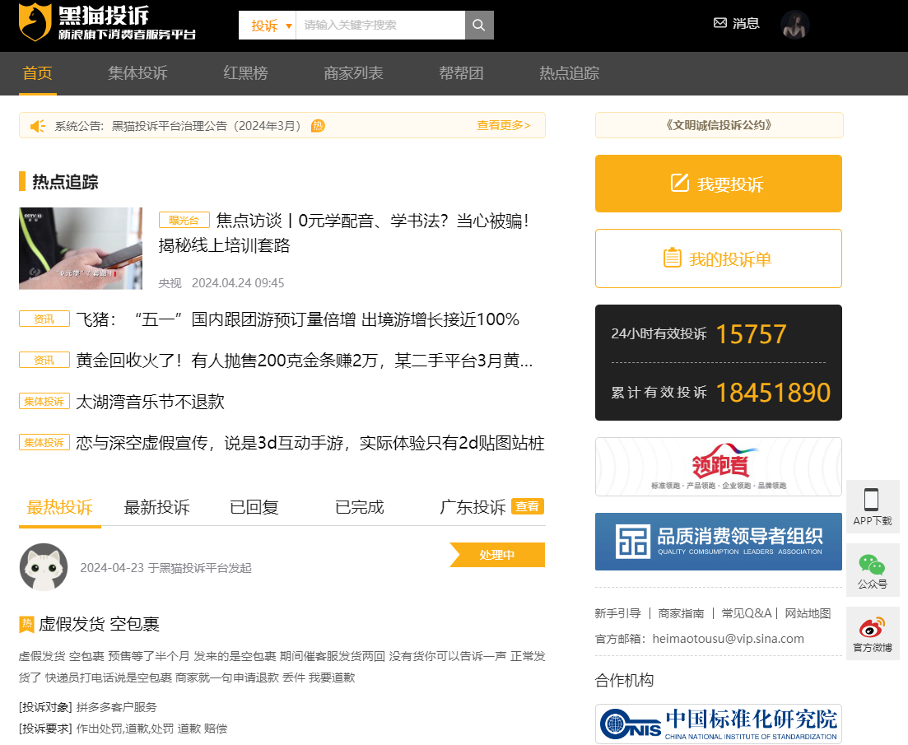

# BuzzMonitor
# **黑猫投诉平台，舆论监控系统**

## 简介

 "[黑猫投诉](https://tousu.sina.com.cn/)"舆论监控系统是一款专为快速识别和响应网络投诉而设计的应用，旨在帮助企业或机构第一时间掌握公众意见和反馈。通过实时监控网站及其他在线平台，系统能够迅速侦测到关于品牌或服务的负面评论、投诉或提议。

 

## 流程

  **下面是一张主流网页加密方法的思维导图** ， **黑猫投诉平台网站使用的即是请求头加密。** 

 参考文档：[https://blog.csdn.net/qq_45270849/article/details/135416529](https://blog.csdn.net/qq_45270849/article/details/135416529)

## 针对企业公司关键字

比如：美团外卖

1、打开页面 https://tousu.sina.com.cn/company/view/?couid=1003626&sid=26857

2、找到商家列表，获取到couid的值，这就是关键字

3、根据关键字组合，解密获取到api接口的数据

 